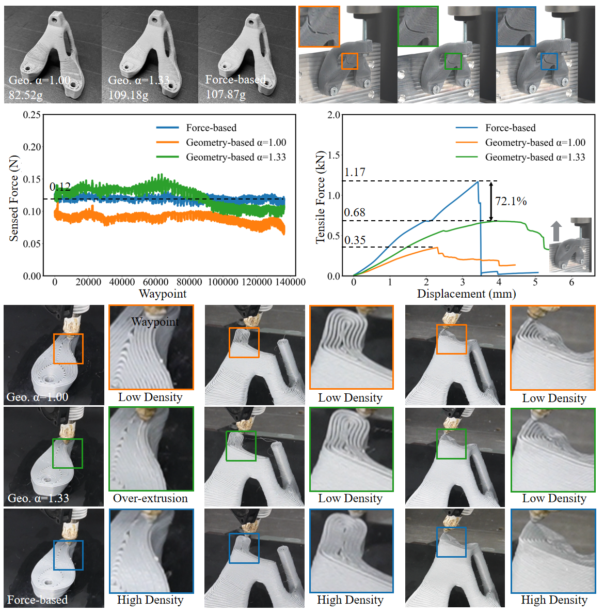

# Force-Based Adaptive Deposition in Multi-Axis Additive Manufacturing: Low Porosity for Enhanced Strength

Robotics and Computer-Integrated Manufacturing

Yuming Huang*, Renbo Su*, Kun Qian, Tianyu Zhang, Yongxue Chen, Tao Liu, Guoxin Fang and Charlie C.L. Wang†

*Joint first authors        
†Corresponding author

[Paper](https://papers.ssrn.com/sol3/papers.cfm?abstract_id=5146382)  [Code](https://github.com/yuminghuang1995/ForceBasedDeposition)  [Video](https://www.youtube.com/watch?v=i_Gpd3_gRxA&feature=youtu.be)

**Force-Based Adaptive Deposition for Curved 3D Printing**

This project addresses the challenge of achieving consistent material deposition in filament-based multi-axis additive manufacturing when printing curved layers. In conventional planar 3D printing, a fixed layer height allows a constant optimal extrusion rate and print speed, ensuring uniform material distribution. However, when layers follow complex curved geometries, local layer thickness varies continuously and deposition angles change across the surface. These variations commonly lead to under-filled regions, visible as porosity, and weaken inter-layer bonding. As porosity errors accumulate over successive layers, particularly in models with many curved layers, parts become prone to reduced mechanical strength, delamination, or fracture.

**Adaptive Deposition through Real-Time Force Sensing**

To overcome these issues, we propose a force-based sensing approach that integrates a compact force sensor into the printhead. By monitoring the resistant force exerted by freshly deposited material in real time, we establish a closed-loop control strategy that dynamically adjusts the printhead feedrate while keeping the extrusion speed constant. Rather than changing extrusion speed, which often suffers from delays due to stepper motor response limits or pressure changes in the melt cavity, our method regulates the printhead’s motion to maintain a target resistant force during printing. Whenever the sensed force falls below the calibrated reference (indicating under-extrusion), the system slows down the printhead locally to deposit extra material. Conversely, when the force exceeds the reference (suggesting over-extrusion), the printhead speeds up to reduce local deposition. This continuous feedback loop ensures more uniform extrusion, minimizes void formation, and enhances filament bonding in curved regions.

**Experimental Validation and Mechanical Strength Improvement**

We implemented the force-based adaptive deposition strategy on a UR5e-based multi-axis printing platform, synchronized with a Duet 3D control board. Physical experiments include printing several test models, such as the Bracket, Bridge, Topology-Optimized block, and Bunny-Head, using both geometry-driven and force-based methods. Tensile testing and SEM imaging reveal that force-based prints consistently achieve higher failure loads and exhibit significantly reduced internal voids compared to purely geometry-based approaches. For instance, on the Topology-optimized model with 359 curved layers, our method yields up to 72% higher failure load than geometry-based curved slicing when normalized by weight. Moreover, when simulating nozzle blockages or missing material segments, force-based control effectively compensates for these imperfections in subsequent layers, demonstrating robustness against unpredictable extrusion errors.

**Repository Structure** 

**Models**: Includes all 3D geometry files (e.g., Bridge, Bracket, Topo-Opt, Bunny-Head) used for printing experiments.

**Toolpaths**: Contains two sets of path definitions for each model. One set follows pure geometry-based planning, while the other incorporates force-based adaptive deposition. Each file lists vertex coordinates, normals, and corresponding extrusion volumes, which are computed from local surface geometry. The format of each file is:

\# List of geometric vertices, with **(x, y, z)** coordinates.

v 6.552 	46.460 	21.690

v ...

...

\# List of vertex normals in **(nx, ny, nz)** form.

vn 0.099 	0.037 	0.994

vn ...

...

\# List of extrusion volume corresponding to every vertex in **(e)** form.

e 0.219

e ...

...

**Conclusion**

By combining geometry-based extrusion estimates with real-time force feedback, this force-based adaptive deposition method significantly reduces porosity and improves mechanical strength in curved 3D printing, offering a robust solution for filament-based multi-axis additive manufacturing. The source code will be released soon.

**Citation**

@article{huang2025Force,  
&nbsp;&nbsp;title={Force-Based Adaptive Deposition in Multi-Axis Additive Manufacturing: Low Porosity for Enhanced Strength},  
&nbsp;&nbsp;author={Huang, Yuming and Su, Renbo and Qian, Kun and Zhang, Tianyu and Chen, Yongxue and Liu, Tao and Fang, Guoxin and Wang, Weiming and Wang, Charlie CL},  
&nbsp;&nbsp;journal={Robotics and Computer-Integrated Manufacturing},  
&nbsp;&nbsp;year={2025},  
&nbsp;&nbsp;publisher={Elsevier}  
}

